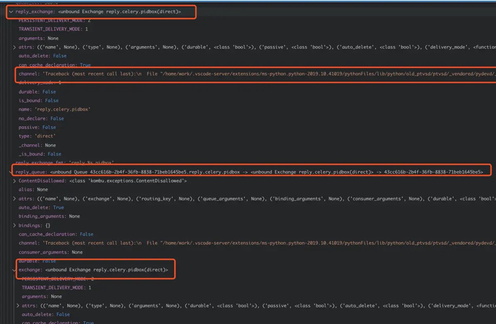

<!--more-->

# celery4.3.0的一个bug排查

## 错误现象

worker-inspect监控功能, 如`celery -A proj inspect stats`
始终报如下错误:
```
Error: No nodes replied within time constraint
```

## 环境

python==3.7.3  
celery==4.3.0  
kombu==4.6.4  
redis==3.2.0  


## debug过程

### 错误历程

开始以为是worker-online事件被自己写的monitor catch主了，想通过屏蔽catch解决，结果发现worker-online事件仅仅是上线的时候会发出这个event,而且inspect和events没有半毛钱关系

### 后来正确历程如下:

搭建了debug环境，观察实例变量，如图：



经调试，发现app.pidbox实例为None

进一步调试发现 celery.pidbox这条路由的channel实例（即connection）有一条隐晦的traceback：
```
'Traceback (most recent call last):\n  File "/home/work/.vscode-server/extensions/ms-python.python-2019.10.41019/pythonFiles/lib/python/old_ptvsd/ptvsd/_vendored/pydevd/_pydevd_bundle/pydevd_resolver.py", line 214, in _get_py_dictionary\n    attr = getattr(var, name)\n  File "/home/work/anaconda3/lib/python3.7/site-packages/kombu/abstract.py", line 119, in channel\n    type(self).__name__))\nkombu.exceptions.NotBoundError: Can\'t call method on Exchange not bound to a channel\n'
```
由此发现原因：
`replay.celery.pidbox`这个routing_key和exchange没有绑定一个channel

当了解到这极可能是一个框架BUG后，分别对celery升级到4.4.0rc3, kombu升级到4.6.5， redis升降级都试过了，均无效。

因此决定从原理和源码入手，重新理解了下路由过程（connection绑定exchange和queue，通过不同的路由方式走connection）和control模块(内建connection，exchange)找到了真正的issue及原因为**当前版本kombu对redis数据操作的抽象问题**
详细原因及解决方案，可参见：

issue: [https://github.com/celery/kombu/issues/1087](https://github.com/celery/kombu/issues/1087)  
pr: [https://github.com/celery/kombu/pull/1089](https://github.com/celery/kombu/pull/1089)
9月1号交的pr，被别人抢先一个多月,哈哈~~~

## 简单解决方案

在不合master代码的情况下（issue上说`kombu 4.6.5 搭配 celery 4.4.0rc4 已经最终解决`），暂时可以通过降级`kombu==4.6.3`解决

